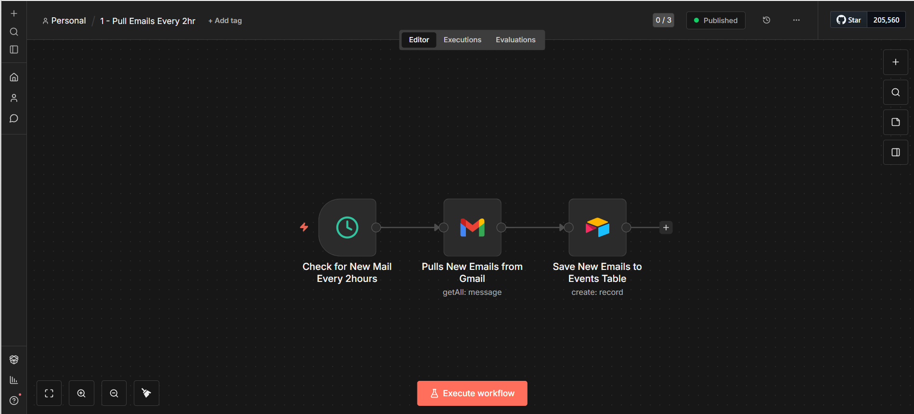
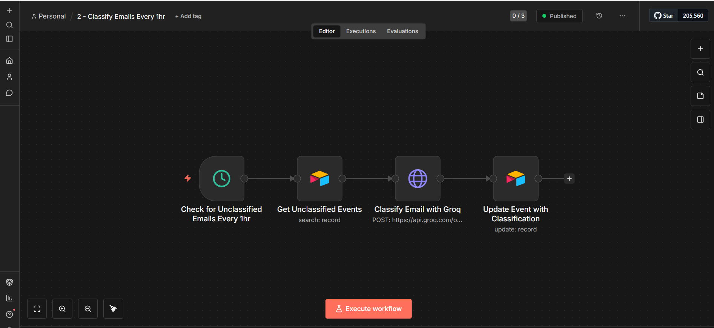
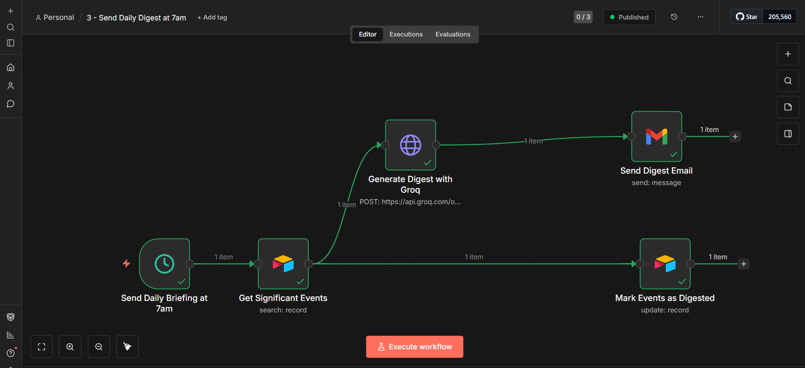
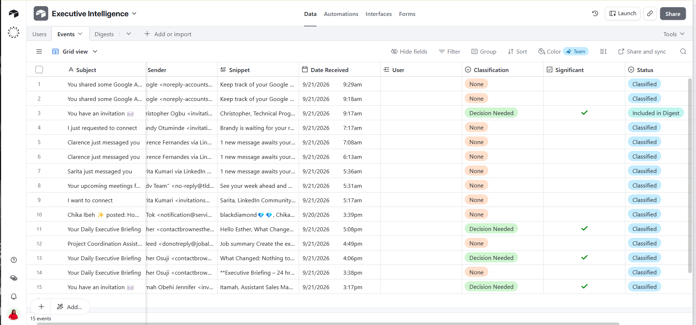
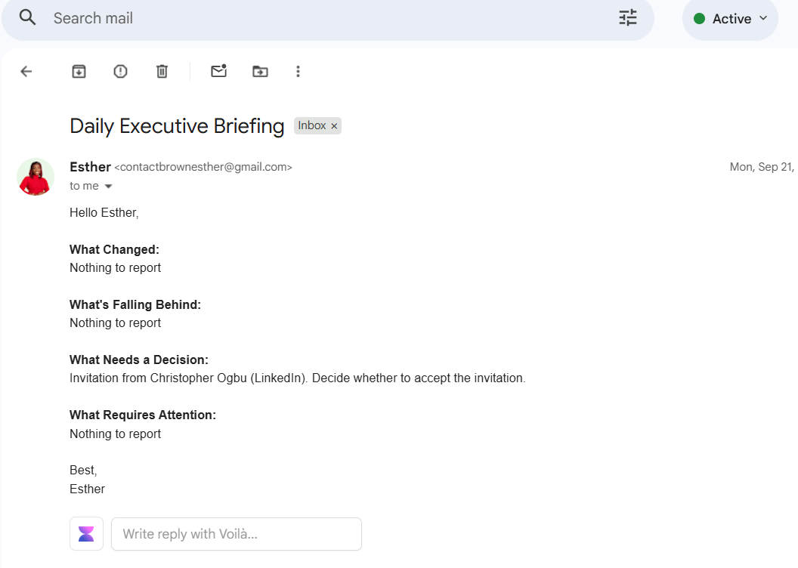

# Automated Email & Executive Briefing System

An AI system that reads a CEO's inbox and tells him what actually 
matters — not a summary of everything.

## Why I built this
I saw a job post from a CEO who wanted exactly this. So I built it 
myself first.

## What it does
Checks Gmail every 2 hours. AI decides what's real signal vs noise — 
a decision needed, a customer issue, a deadline change. Every morning 
at 7am it sends one clean briefing: what changed, what's falling 
behind, what needs a decision.

Built with n8n, Groq AI, and Airtable. Working end to end right now.

## Demo
[Watch a walkthrough](paste-your-loom-link-here)

## Stack
- n8n (workflow orchestration)
- Groq AI (email analysis and prioritization)
- Airtable (data storage)
- Gmail (source inbox)

## How it works
Three scheduled n8n workflows run in sequence:

1. **Pull Emails Every 2hr** — checks Gmail for new mail and saves 
   each one as a record in an Airtable Events table
2. **Classify Emails Every 1hr** — pulls unclassified events, sends 
   each to Groq AI for classification (Decision Needed, Customer 
   Issue, None, etc.), and updates the record
3. **Send Daily Digest at 7am** — pulls all significant events, 
   generates a clean summary with Groq, emails it, then marks those 
   events as digested

## Status
Still adding urgent alerts and links back to original emails.

## Files
- `ai-executive-briefing.json` — main workflow

## Screenshots

**Workflow 1 — Pull emails every 2hr**

**Workflow 2 — Classify emails every 1hr**

**Workflow 3 — Send daily digest at 7am**

**Airtable Events table**

**Sample briefing email**

## Note
API keys and credentials have been removed from this export. To run 
this yourself, you'll need your own Groq API key and Gmail/Airtable 
credentials set up in n8n.
